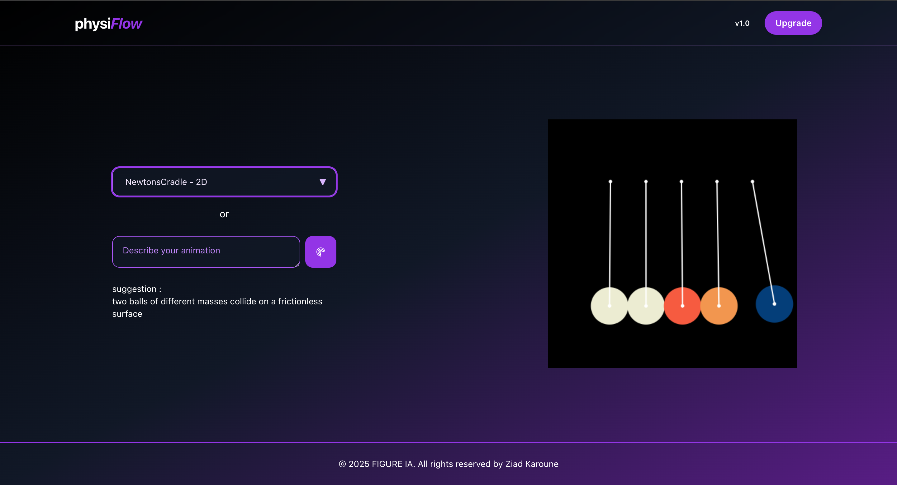

# Interactive Physics Simulator with LLM-Based Scenario Scripting — **physiflow**

## Project Overview

**Physiflow** is an interactive physics simulator that lets users describe physics scenarios in natural language, which are then rendered as interactive 2D animations using the Matter.js physics engine. Built with React and styled with Tailwind CSS, the simulator offers a responsive, user-friendly interface.

The goal is to enhance physics education by making physics concepts accessible and engaging through dynamic simulation. it integrates a Large Language Model (LLM) to automatically interpret natural language descriptions and generate dynamic simulation scripts on the fly.

---

## Features

- Natural Language Input: Describe physics scenarios in plain text.

- **LLM-Powered Scenario Scripting: Automatically generate Matter.js simulation code from user descriptions via an AI backend.**

- Interactive **2D Simulations**: Render physics experiments dynamically on a 400x400 pixel canvas.

- Multiple Animations: Includes **built-in simulations** such as:

     **Newton’s Cradle , Pendulum ...**

- User Interface: Clean React UI with dropdown selection and input field.

- Graceful Fallbacks: Friendly messages when requested animations are not available.

- Secure API Key Usage: **Backend uses an API key for authentication with the LLM service..**

---

## Technologies Used

- **React:** UI component library
- **Matter.js:** 2D physics engine for rigid body simulation
- **Tailwind CSS:** Utility-first CSS framework for styling
- **Vite:** Fast development and build tool
- **Express** Node.js server for API proxying and LLM integration
- **OpenRouter API**: (model: **qwen/qwen3-coder**)LLM service to generate simulation scripts
---

## Getting Started

### Prerequisites

- Node.js (v20.19.0 or higher recommended)
- npm or yarn package manager
- new api key from OpenRouter 

### Obtaining an API Key
- To use the LLM features, you need an API key from OpenRouter:

- Visit OpenRouter and sign up for a free account.

- Navigate to your dashboard and generate a new API key.

- Copy the key and add it to your .env file as API_KEY.

- Restart your backend server to load the new environment variable.

### Installation

```bash
git clone https://github.com/ziadkaroune/physiflow.git
cd interactive-physics-simulator
```

### Running frontend
```bash
cd Frontend
npm install
npm run dev
http://localhost:5173/ (depends your vite port config)
```
### Running backend
```bash
cd Backend

create .env file \
API_KEY=your_apikey_here (without a space check .env.example)\
PORT=3000

node server.js
http://localhost:3000 
```

[](https://creativecommons.org/licenses/by-nc/4.0/)